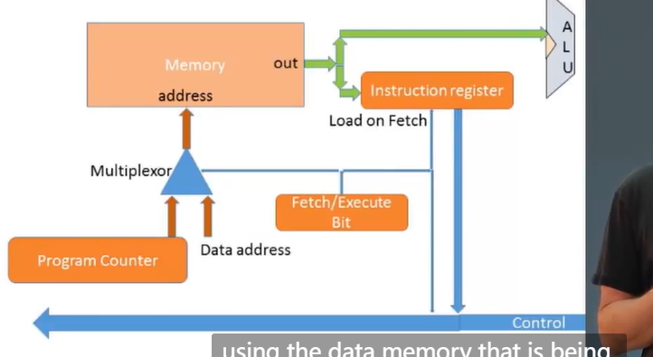

# project5

we use three buses, control bus, address bus, and data bus to connect memory, CPU. Memory has two parts, Data memory and Program memory; CPU has two parts: ALU and Registers.

And this is fetch-execute cycle. We fetch an instruction, and execute it, and then we fetch the next instruction.

fetch:
1. put the location of the next instruction into the address of the program memory
2. get the instruction code itself by reading the contents at that location

execute:
the instruction code specifies "what todo", 
Executing the operation involves also accessing registers and/or data memory.

When fetch, we put instruction address, and we get the instruction; When execute, we put data address, and we get the data to execute.